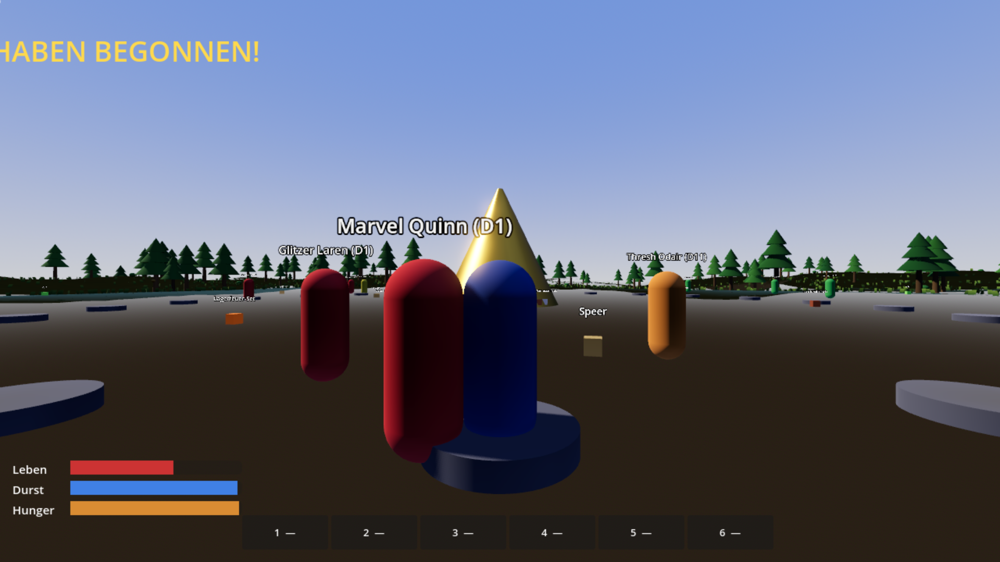
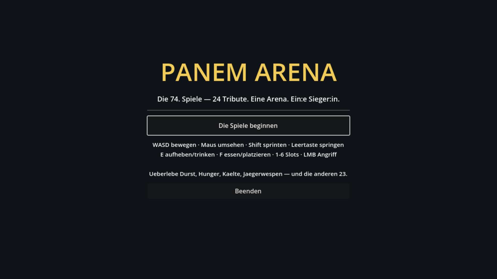

# Panem Arena

Ein 3D-Survival-Battle-Royale nach Vorbild der 74. Hungerspiele — gebaut mit **Godot 4.7** (Forward+). Privates Fanprojekt.

24 Tribute, ein Füllhorn voller Loot, eine Arena mit Wald und See, Spielmacher, die das Wetter kontrollieren — und nur eine:r überlebt.

## Spielen

1. [Godot 4.7+](https://godotengine.org/download) installieren (macOS: `brew install --cask godot`)
2. Godot öffnen → Projekt importieren → diesen Ordner wählen
3. **F5** (bzw. ▶) startet die Arena

### Steuerung

| Taste | Aktion |
|---|---|
| **WASD** + Maus | Bewegen / Umsehen |
| **Shift** | Sprinten |
| **Leertaste** | Springen |
| **E** | Aufheben / Trinken (am See) |
| **F** | Essen / Trinken / Heilen (gewählter Slot) |
| **1–6** | Inventar-Slot wählen |
| **Linke Maustaste** | Angriff |
| **Esc** | Maus freigeben |

### Regeln

- 60 Sekunden Countdown auf der Startplatte, dann beginnt das Blutbad ums Füllhorn.
- Durst leert sich in ~1,5 Tagen, Hunger in ~2,5 — trink am See/Teich, iss aus deinem Inventar.
- Karrieros (rot) stürmen das Füllhorn und bewachen es danach. Weiche ihnen aus — oder kämpfe.
- **Bogen** ausrüsten + Pfeile im Gepäck = Fernkampf; verschossene Pfeile stecken im Boden und sind bergbar.
- Waffentreffer können **Blutungen** verursachen — nur Verband/Medizin stoppt sie.
- **Beeren** an Sträuchern pflücken — aber 15 % sind Nachtschatten (tödlich!). Hohe Überlebens-Werte erkennen die Gefahr.
- **Jagen:** Kaninchen mit Bogen oder Klinge erlegen → rohes Fleisch → am Lagerfeuer **braten** ([E] am Feuer) für die beste Mahlzeit im Spiel.
- In tiefer Nacht (23–5 Uhr) droht **Kälteschaden** — Schlafsack oder Lagerfeuer (F platzieren) schützt. Aber: Feuerschein lockt Jäger an.
- Abends zeigt der Himmel die Gefallenen des Tages.
- Sieg: Als letzte:r übrig bleiben.

## Entwicklung

- Design: [GAME_DESIGN.md](GAME_DESIGN.md) · Umsetzungsplan: [PLAN.md](PLAN.md)
- Headless-Schnelltest (5 s Countdown, 60 s Tage): `PANEM_FAST=1 godot --headless .`

## Status

- [x] Phase 0 — Projektgerüst
- [x] Phase 1 — Graybox-Prototyp (Arena, Loot, KI-Tribute, Tag/Nacht, Bedürfnisse)
- [x] Phase 2 — Survival Slice (Bogen, Blutungen, KI-Sinne, Beeren/Nachtschatten, Lagerfeuer, Nachtkälte)
- [x] Phase 3 — Gamemaker-Regie (Wetter, Waldbrand, Jägerwespen, Feast, Wolfsmutt-Finale, Sponsoren)
- [x] Phase 4 — Grafik-Pass (prozedurales Terrain, Shader, Partikel, Tag/Nacht-Licht)
- [x] Phase 5 — Inhalt & Polish (Hauptmenü, Karriero-Verrat, Statistik, Balancing)
- [x] Polish-Runde — Jagd + Braten, Tribut-Vorstellung im Countdown, prozeduraler Sound (Kanone, Bogen, Spotttölpel-Motiv, Wind)
- [ ] Offen: Reaping-Zeremonie, Zwei-Sieger-Modus, Audio-Ausbau mit echten Samples

*Hinweis: „Die Tribute von Panem" ist geschützte IP von Suzanne Collins/Lionsgate. Dieses Fanprojekt ist nicht kommerziell.*
